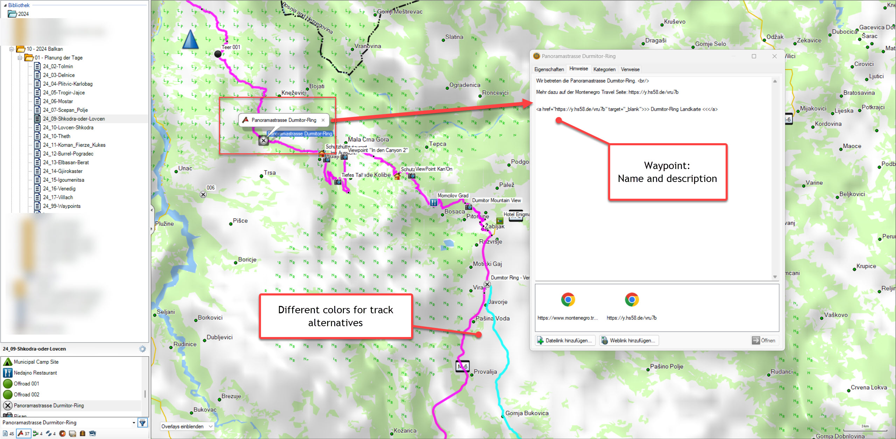
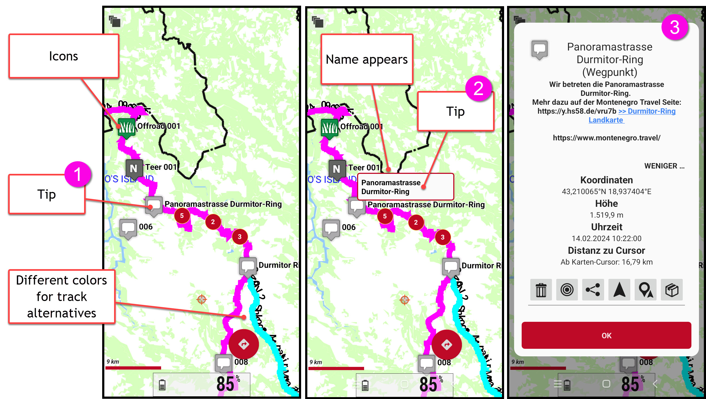

# **GPX\_2\_KML\_4\_Orux**

## Version and Licence ##

- Version 02/2024
 Written by Hans Strassguetl - [https://gravelmaps.de](https://gravelmaps.de/)  
 Licenced under [https://creativecommons.org/licenses/by-sa/4.0/](https://creativecommons.org/licenses/by-sa/4.0/)  
- Icons used are licensed under  
 Map Icons Collection  
 Creative Commons 3.0 BY-SA  
 Author: Nicolas Mollet  
[https://mapicons.mapsmarker.com](https://mapicons.mapsmarker.com/)  

## About ##

This program is used to convert GPX files exported from Garmin Basecamp in one go into a KML file that can be imported by **OruxMaps**.

Be aware

- Basecamp uses a Garmin implementation of GPX that differs from the standard GPX in aspects like colour. To receive a full set of features, make sure you source your tracks and waypoints from Garmin Basecamp.
- Even if the App is designed to use Garmin GPX files, it works with standard GPX files too.
- Files converted by this App won't fully support all features of Maps.me and Organic.Maps. They have implemented their own KML structure. In case you want to use organicMaps, use **GPX\_2\_KML\_4\_Orga**.

## Use: ##

## Planning: ##

Planning is done in Garmin Basecamp.

- Waypoints shall be named without special characters (ä/ö/ü etc)
- Tracks shall be named without special characters (ä/ö/ü etc)
- Waypoints and Tracks may include a description
- Export data via Basecamp File -\> Export function.

## Conversion ##

GPX\_2\_KML\_4\_Orux has no user interface. You just take your exported GPX and drag & drop it onto the exe. As a result, you have a converted KML with the same name in the same directory as the GPX. If there are any errors, you will be informed.

## Example ##

Planning in Basecamp:  

Screenshots from OruxMaps:  

## Data privacy ##
- By design XML structures as GPX and KML reach out for external servers. For example, interpreting the Garmin GPX, you will find certain html addresses in the GPX's header that support interpreting the structure.
- Using icons make the KML interpreter (as Oruxmaps) reaching out to my server via [http://motorradtouren.de/pics](http://motorradtouren.de/pics)
 No access data is collected or stored for this service by this program or on the server motorradtouren.de.

## Read more ##

If you want to understand more in terms how you can customize icons and tracks colors, read: **readme-licence.pdf**

